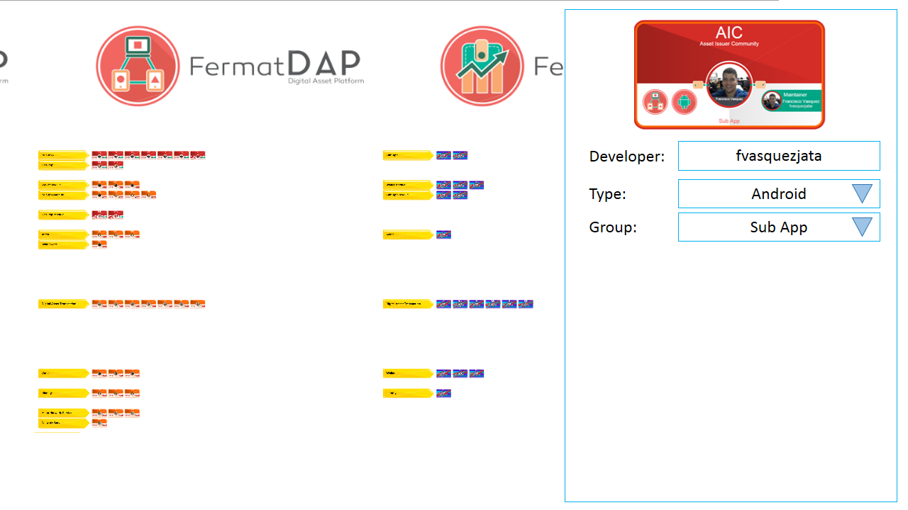

#Fermat.org Version 3

This bounty is to develop the fermat.org site (curretly http://dev.fermat.org) in its third version, which new ability will be to edit the former fermatManifest.xml online using the website and save it to the database. The website will require the user to login in a GitHub user account in order to keep track on who changes what.

At the first version of it, and for this bounty, the website sould do the required tasks usings *wizards*: forms with all the required options to do the task. The tile wizard should be something as in this minimalist draft (not a restriction, the design can change):

##Functional Requirements

For this bounty to be aproved, the next requirements must be met:

In this version, fermat.org will be able to let the user edit the manifest by adding, editing and removing tiles and workflows. The functional requirements are:

- Authenticate a github user account.
- Have a wizard to add/edit/remove tiles in the "table" view.
- Have a wizard to add/edit/remove workflows.